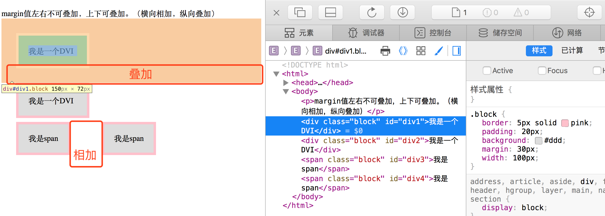
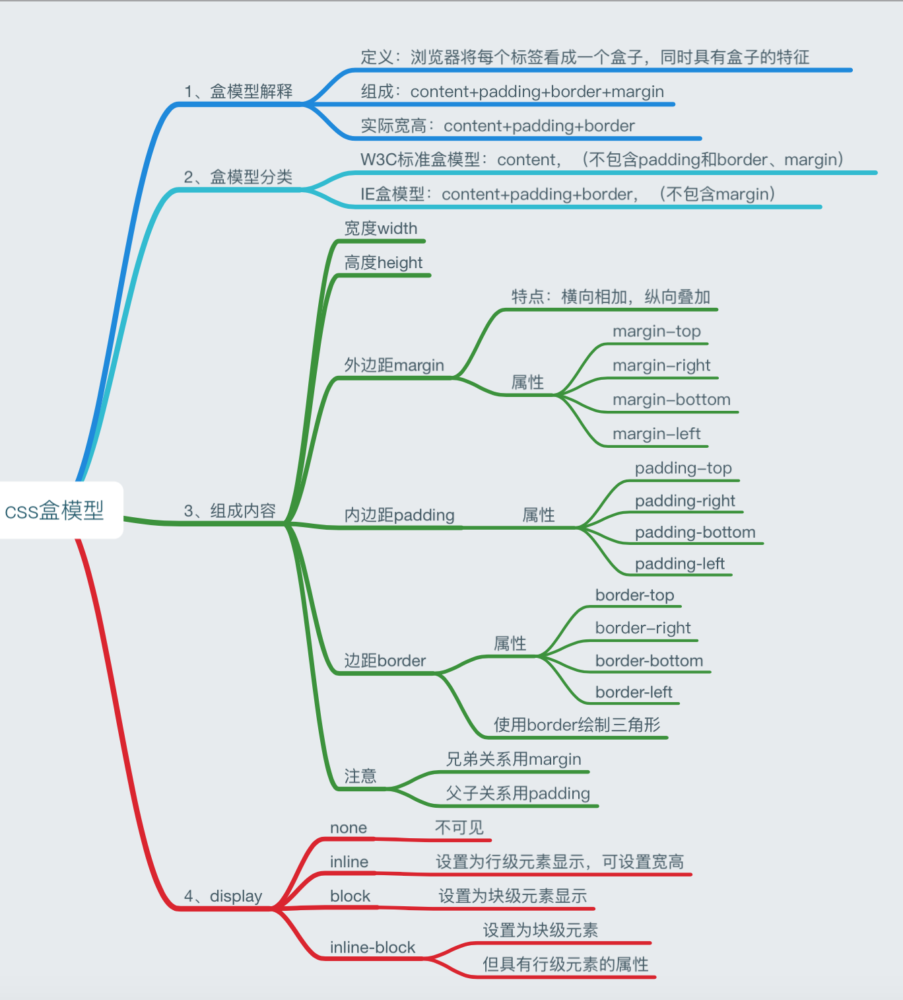

　**盒模型**：文档中的每个元素被描绘为矩形盒子，渲染引擎的目的就是判定大小，属性——比如它的颜色、背景、边框方面——及这些盒子的位置。

## 盒模型概念

　　在CSS中，这些矩形盒子用标准盒模型来描述。这个模型描述了一个元素所占用的空间。每一个盒子有四条边界：外边距边界margin edge，边框边界border edge，内边距边界padding edge和内容边界content edge。

　　内容区域是真正包含元素内容的区域，位于内容边界的内部，它的大小为内容宽度或content-box宽及内容高度或content-box高。如果box-sizing为默认值，width、min-width、max-width、height、min-height和max-height控制内容大小。

　　内边距区域padding area用内容可能的边框之间的空白区域扩展内容区域。通常有背景——颜色或图片（不透明图片盖住背景颜色）。

　　边框区域扩展了内边距区域。它位于边框边界内部，大小为border-box宽和border-box高。

　　外边距区域margin area用空白区域扩展边框区域，以分开相邻的元素。它的大小为margin-box的高宽。

　　在外边距合并的情况下，由于盒之间共享外边距，外边距不容易弄清楚。

　　对于非替换的行内元素来说，尽管内容周围存在内边距与边框，但其占用空间（行高）由line-height属性决定。

> 详见【[demo](/widget/css/box-sizing.html)】

## 盒子模型分类

**W3C标准盒子模型和IE盒子模型** 

### 差异

- W3C盒子模型——属性高（height）和属性宽（width）这两个值不包含 填充（padding）和边框（border）

- IE盒子模型——属性高（height）和属性宽（width）这两个值包含 填充（padding）和边框（border）

我们在编写页面代码的时候应该尽量使用标准的W3C盒子模型（需要在页面中声明DOCTYPE类型）。

各浏览器盒模型的组成结构是一致的，区别只是在"怪异模式"下宽度和高度的计算方式，而“标准模式”下则没有区别。组成结构以宽度为例：总宽度=marginLeft+borderLeft+paddingLeft+contentWidth+paddingRight+borderRight+marginRight**（W3C标准盒子模型）**。页面在“怪异模式”下，css中为元素的width和height设置的值在标准浏览器和ie系列(ie9除外)里的代表的含义是不同的**（IE盒子模型）**。 

### 解决方法 

- 将页面设为“标准模式”。添加对应的dtd标识
- 使用hack或者在外面套上一层wrapper
- 通过{ box-sizing: border-box; }，统一IE和非IE浏览器的差异。

### 总结归纳

##  * { box-sizing: border-box; } 的作用

说到 IE 的 bug，在 IE6以前的版本中，IE对盒模型的解析出现一些问题，跟其它浏览器不同，将 border 与 padding 都包含在 width 之内。而另外一些浏览器则与它相反，是不包括border和padding的。对于IE浏览器，当我们设置 box-sizing: content-box; 时，浏览器对盒模型的解释遵从我们之前认识到的 W3C 标准，当它定义width和height时，它的宽度不包括border和padding；对于非IE浏览器，当我们设置box-sizing: border-box; 时，浏览器对盒模型的解释与 IE6之前的版本相同，当它定义width和height时，border和padding则是被包含在宽高之内的。内容的宽和高可以通过定义的“width”和 “height”减去相应方向的“padding”和“border”的宽度得到。内容的宽和高必须保证不能为负，必要时将自动增大该元素border box的尺寸以使其内容的宽或高最小为0。

　　使用 * { box-sizing: border-box; }**能够统一IE和非IE浏览器之间的差异**。

**参考**

- [解释一下你对盒模型的理解，以及如何在 CSS 中告诉浏览器使用不同的盒模型来渲染你的布局。](http://blog.csdn.net/xujie_0311/article/details/42372871)
- [MSDN：盒模型](https://developer.mozilla.org/zh-CN/docs/Web/CSS/CSS_Box_Model/Introduction_to_the_CSS_box_model)