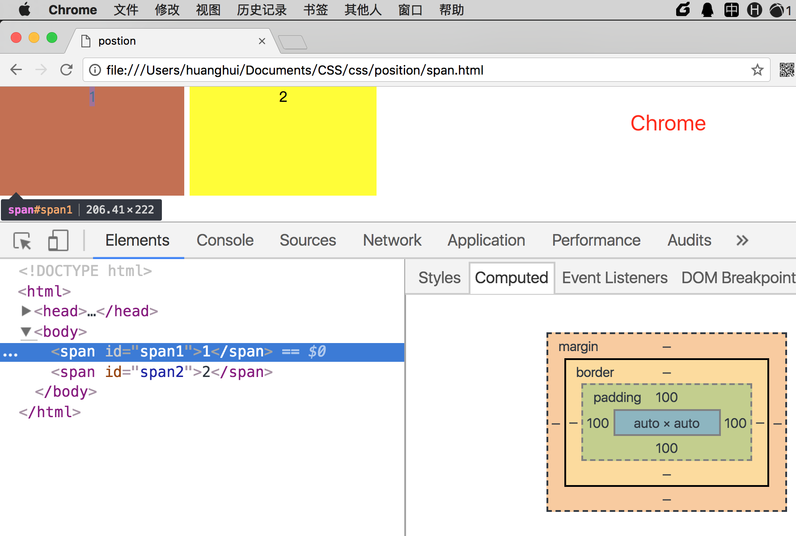
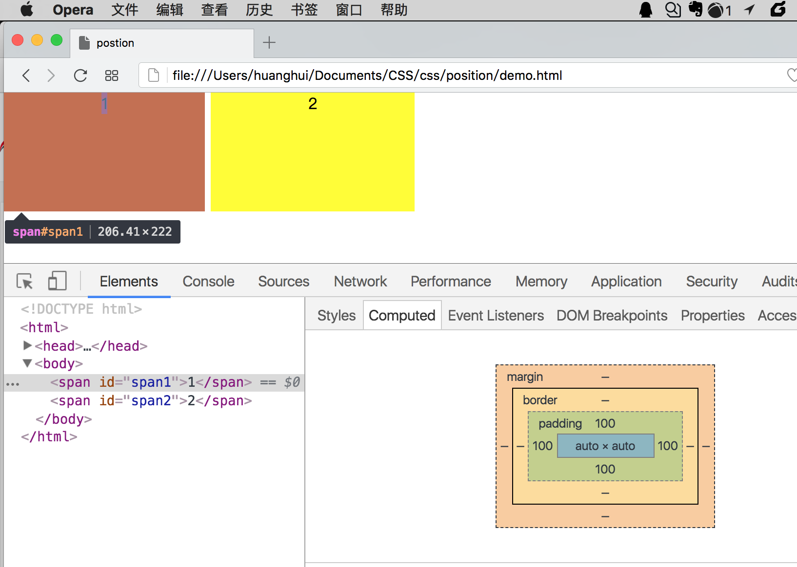
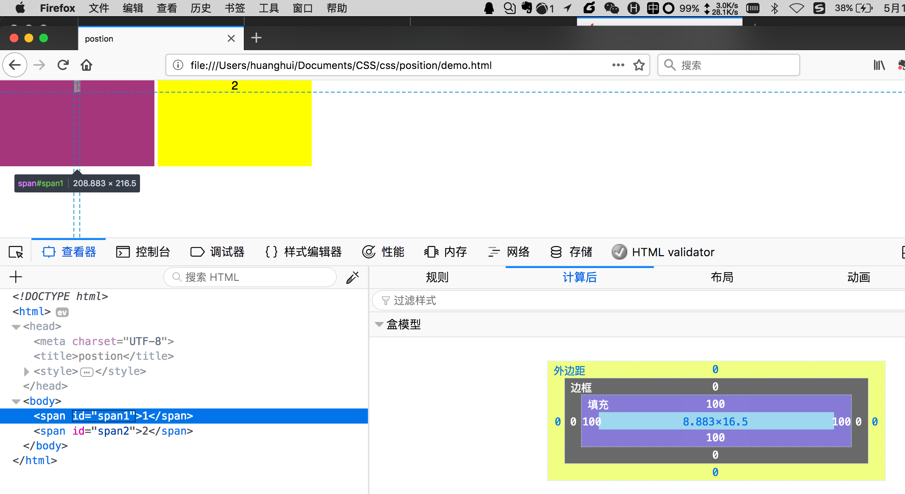
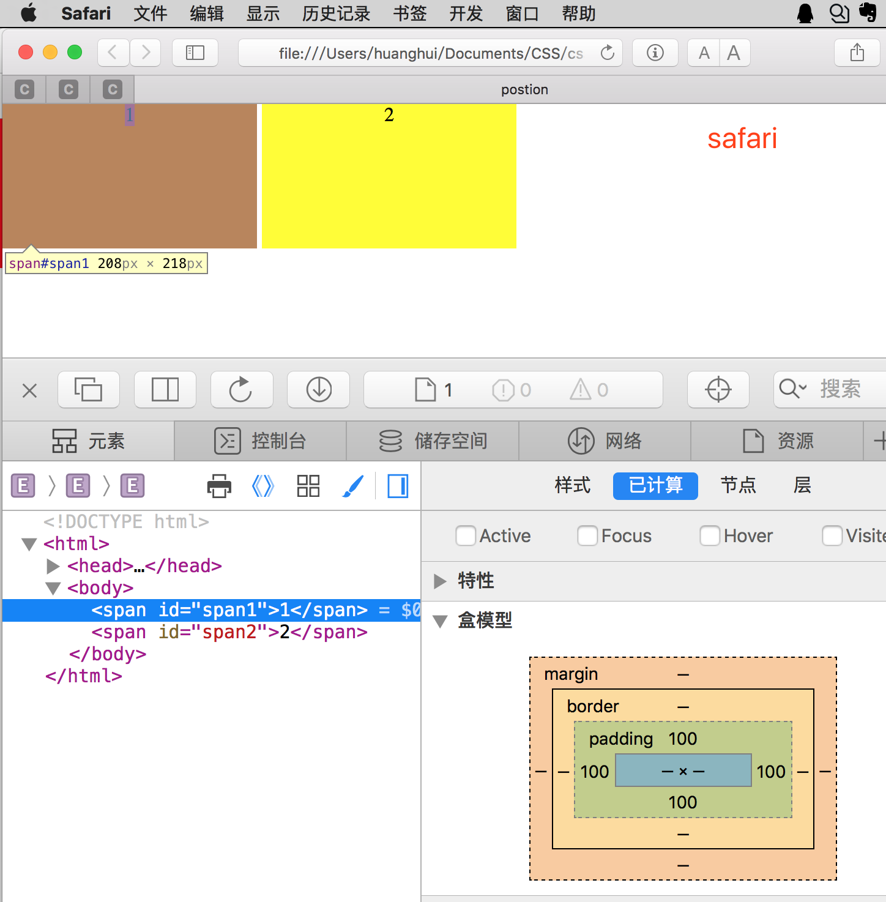
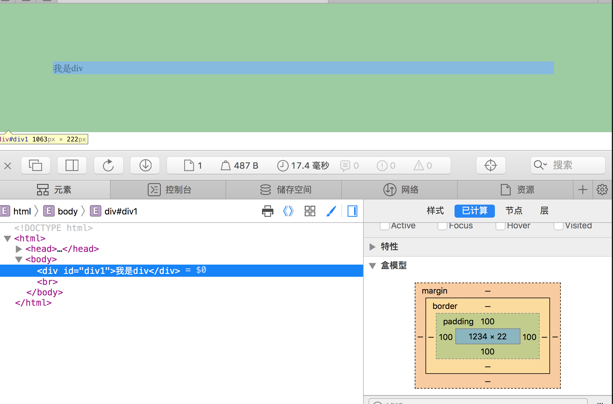

根据以下位置，说一下span的位置是什么，盒模型的位置是什么呢？

## 一、代码

```html
<!DOCTYPE html>
<html>
<head>
    <meta charset="UTF-8">
    <title>CSS-span</title>
    <style>
        *{margin:0px;padding:0px;}
        span{padding:100px;}
        #span1{background: red}
        #span2{background: blue}
    </style>
</head>
<body>
    <span id='span1'>1</span>
    <span id='span2'>2</span>
</body>
</html>
```

如果是页面直接执行的话，肯定很块就能知道每个区域的位置，但为什么呢？

考察点：盒模型、行内元素、行内元素默认行高等。

## 二、显示效果图



## 三、分析

### 1、接下来做一个详细分析

- **盒模型**：不管是行内元素还是块级元素，padding值都是可以生效的，都会产生高度。所以两个盒模型都在，而且是在同一行内显示。
- **元素在盒模型中的位置**：由于是行内元素，没有不产生高度，显示在最上面的位置。如果是块级元素，则显示在中间位置。
- **盒模型高度**：除了加上两个padding值以外，还有元素自身的高低。每个浏览器默认的自身的高度不一样。Chrome和Opera默认是 6.41 x 22 ，FF默认是 8.83 x 16.5 ，Safari默认是 8 x 18。

### 2、span在不同浏览器中的默认尺寸

- chrome：默认6.41*22

  

- Opera：默认6.41*22

  

- FF：默认 8.83*16.5

  

- Safari：默认8*18

  


## 如果是div呢

如果是一个div，块级元素，其padding:100px。那么div显示的情况，需要注意两点：

- 垂直方向，div在盒模型的中间位置，因为是块级元素。
- 水平方向，记住是100%显示，同时居左侧100px的内边距。




> 【[具体效果](/widget/css/span.html)】

