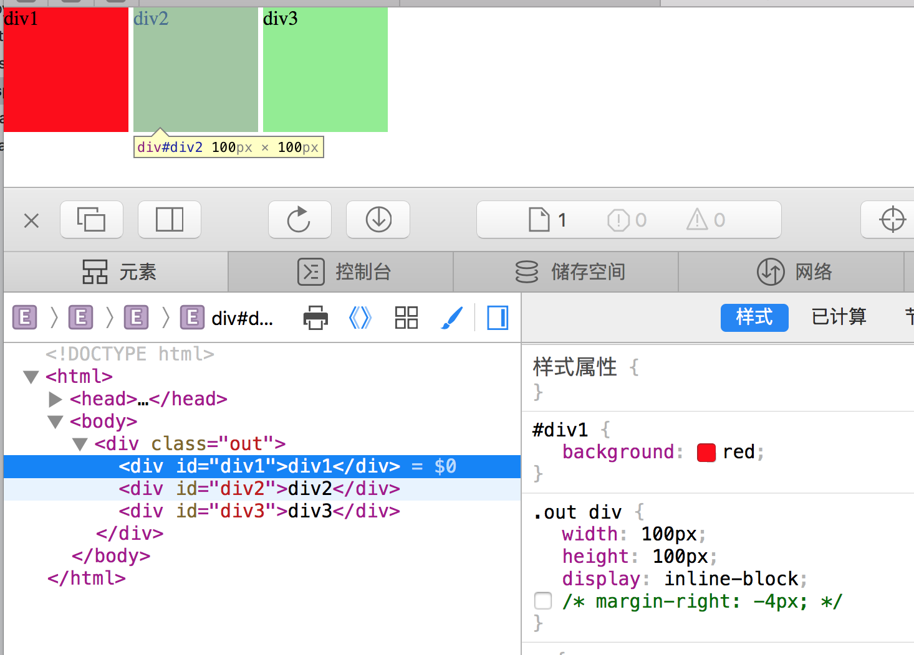
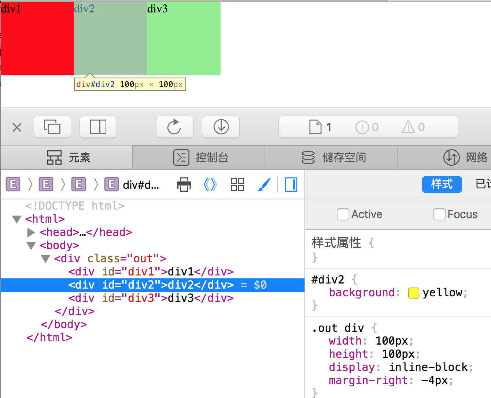

列出display相关属性，掌握基本用法。

## 所有取值

| 值                 | 描述                                                         |
| ------------------ | ------------------------------------------------------------ |
| none               | 此元素不会被显示。                                           |
| block              | 此元素将显示为块级元素，此元素前后会带有换行符。             |
| inline             | 默认。此元素会被显示为内联元素，元素前后没有换行符。         |
| inline-block       | 行内块元素。（CSS2.1 新增的值）                              |
| list-item          | 此元素会作为列表显示。                                       |
| run-in             | 此元素会根据上下文作为块级元素或内联元素显示。               |
| compact            | CSS 中有值 compact，不过由于缺乏广泛支持，已经从 CSS2.1 中删除。 |
| marker             | CSS 中有值 marker，不过由于缺乏广泛支持，已经从 CSS2.1 中删除。 |
| table              | 此元素会作为块级表格来显示（类似` <table>`），表格前后带有换行符。 |
| inline-table       | 此元素会作为内联表格来显示（类似 `<table>`），表格前后没有换行符。 |
| table-row-group    | 此元素会作为一个或多个行的分组来显示（类似 `<tbody>`）。     |
| table-header-group | 此元素会作为一个或多个行的分组来显示（类似` <thead>`）。     |
| table-footer-group | 此元素会作为一个或多个行的分组来显示（类似` <tfoot>`）。     |
| table-row          | 此元素会作为一个表格行显示（类似 `<tr>`）。                  |
| table-column-group | 此元素会作为一个或多个列的分组来显示（类似 `<colgroup>`）。  |
| table-column       | 此元素会作为一个单元格列显示（类似` <col>`）                 |
| table-cell         | 此元素会作为一个表格单元格显示（类似 `<td>` 和` <th>`）      |
| table-caption      | 此元素会作为一个表格标题显示（类似` <caption>`）             |
| inherit            | 规定应该从父元素继承 display 属性的值。                      |

- 常用值：none、block、inline-block。

## 三个元素一行排列：inline-block

- 代码：

  ```html
  <!DOCTYPE html>
  <html>
  <head>
      <meta charset="UTF-8">
      <title>display:inline-block</title>
      <style>
          *{padding:0;margin:0;}
          .out div{width: 100px;height:100px;display: inline-block;margin-right: -4px}
          #div1{background: red;}
          #div2{background: yellow}
          #div3{background: lightgreen}
      </style>
  </head>
  <body>
      <div class="out">
          <div id="div1">div1</div>
          <div id="div2">div2</div>
          <div id="div3">div3</div>
      </div>
  </body>
  </html>
  ```

- 效果
  - 不添加margin-right，有间隙：

    

  - 添加了margin-right，无间隙：

    

- 知识点：

  - display：inline-block比float效率更高。
  - inline-block默认情况下会尝试间隙，可以通过margin-right:-4px来解决。还可以通过letter-spaceing来解决，父元素设置为`letter-spaceing:-4px`，下面的div设置为`letter-spaceing:0`，但是只能兼容到IE11。​