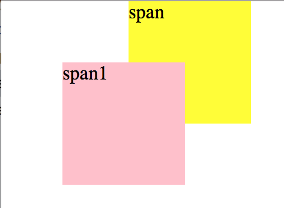
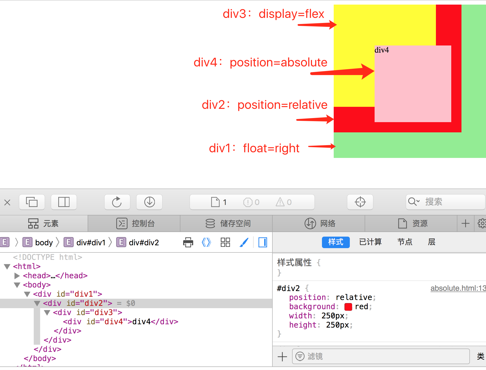

position的定位需要有个详细的了解，仔细分析每一个属性。

## 可能的值

| 值       | 描述                                                         |
| -------- | ------------------------------------------------------------ |
| absolute | 生成绝对定位的元素，相对于 static 定位以外的第一个父元素进行定位。元素的位置通过 "left", "top", "right" 以及 "bottom" 属性进行规定。 |
| fixed    | 生成绝对定位的元素，相对于浏览器窗口进行定位。元素的位置通过 "left", "top", "right" 以及 "bottom" 属性进行规定。 |
| relative | 生成相对定位的元素，相对于其正常位置进行定位。因此，"left:20" 会向元素的 LEFT 位置添加 20 像素。 |
| static   | 默认值。没有定位，元素出现在正常的流中（忽略 top, bottom, left, right 或者 z-index 声明）。 |
| inherit  | 规定应该从父元素继承 position 属性的值。                     |

## 问题

### 1、relative

- 定义：生成相对定位，相对于其正常位置进行定位。

- 实例：

  ```html
  <!DOCTYPE html>
  <html lang="en">
  <head>
      <meta charset="UTF-8">
      <title>relative</title>
      <style>
          *{margin:0;padding:0;}
          span{display: inline-block;width:100px;height: 100px}
          #span1{background: pink;position: relative;top:50px;left:50px;}
          #span2{background: yellow}
      </style>
  </head>
  <body>
      <span id="span1">span1</span>
      <span id="span2">span</span>
  </body>
  </html>
  ```

- 效果：

  

- 分析：relative只是相对于自己本身的位置进行定位的，而且还在正常文档流里面，不影响span2的定位。

### 2、absolute

- 定义：生成绝对定位的元素，相对于 static 定位以外的第一个父元素进行定位。

- 实例：

  ```html
  <!DOCTYPE html>
  <html>
  <head>
      <meta charset="UTF-8">
      <title>absolute</title>
      <style>
          #div1{
              float:right;
              background: lightgreen;
              width: 300px;height: 300px;
          }   
          #div2{
              position: relative;
              background: red;
              width: 250px;height:250px;
          }
          #div3{
              display: flex;
              background: yellow;
              width: 200px;height: 200px;
          }
          #div4{
              position: absolute;right:20px;bottom:20px;
              background: pink;
              width: 150px;height: 150px;
          }
      </style>
  </head>
  <body>
      <div id="div1">
          <div id="div2">
              <div id="div3">
                  <div id="div4">div4</div>
              </div>
          </div>
      </div>
  </body>
  </html>
  ```

- 效果图：

  

- 分析：由以上实例可以看出，absolute是相对于其父级不为static定位的第一个元素来进行定位的，已经移除了正常的文档流。div4相对于div2设置有position为relative的地方。