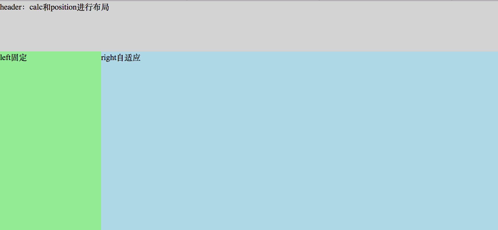
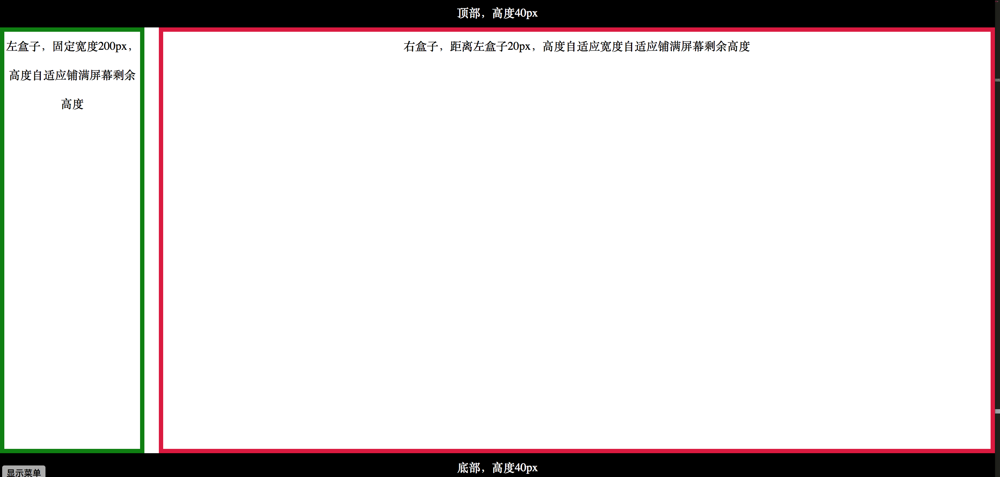

布局，实现左侧固定，右侧自适应的布局

## 一、通过calc，兼容ie9+

- 代码

  ```html
  <!DOCTYPE html>
  <html>
  <head>
      <meta charset="UTF-8">
      <title>布局，实现左侧固定，右侧自适应的布局</title>
      <style>
          *{padding:0;margin:0;}
          html,body{height: 100%}
          .header{
              height: 100px;
              background: lightgrey;
          }
          .content{
              height: calc(100% - 100px);
              position: relative;
              background: lightyellow;
          }
          .left{
              width: 200px;
              height:100%;
              position: absolute;
              background: lightgreen;
          }
          .right{            
              height:100%;
              margin-left:200px;
              background: lightblue;
          }
      </style>
  </head>
  <body>
      <div class="header">header：calc和position进行布局</div>
      <div class="content">
          <div class="left">left固定</div>
          <div class="right">right自适应</div>
      </div>
  </body>
  </html>
  ```

- 效果

  

- [实际页面](/widget/css/layout.html)

## 二、通过box-sizing: border-box;

- 代码

  ```html
  <!DOCTYPE html>
  <html>
  <head lang="en">
      <meta charset="UTF-8">
      <title>布局2，通过box-sizing: border-box;</title>
      <style>
          *{margin:0;padding:0;}
          .top {
              width: 100%;
              height: 40px;
              background: #000;
              color:#fff;
              position:absolute;
              top:0;
              text-align:center;
              line-height:40px;
          }
          .bottom{
              width:100%;
              height:40px;
              background:#000;
              color:#fff;
              position:absolute;
              bottom:0;
              text-align:center;
              line-height:40px;
          }
          .mainBox{
              width:100%;
              position:absolute;
              top:40px;
              bottom:40px;
          }
          .mainBox .leftBox{
              height:100%;
              width:200px;
              float:left;
              margin-bottom:40px;
              overflow: auto;
              border:6px solid green;
              box-sizing: border-box;
              text-align:center;
              line-height:40px;
          }
          .mainBox .rightBox{
              height:100%;
              margin-left:220px;
              border:6px solid crimson;
              box-sizing: border-box;
              overflow: auto;
              text-align:center;
              line-height:40px;
          }
      </style>
  </head>
  <body>
  <div class="top">顶部，高度40px</div>
  <div class="mainBox">
      <div class="leftBox">左盒子，固定宽度200px，高度自适应铺满屏幕剩余高度</div>
      <div class="rightBox">右盒子，距离左盒子20px，高度自适应宽度自适应铺满屏幕剩余高度</div>
  </div>
  <div class="bottom">底部，高度40px</div>
  </body>
  </html>
  ```

- 效果

  

- [实际页面](/widget/css/layout3.html)


> [demo代码](https://github.com/huanghui8030/CSS/tree/master/css/position)