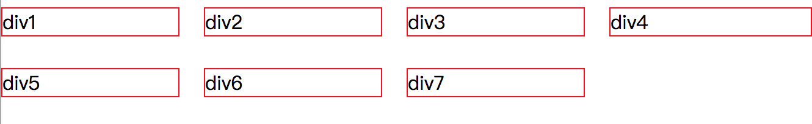
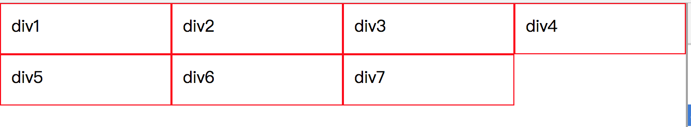

通过css3中的flex布局，实现一个流式布局：每行的项目数固定为4个块，然后会自动进行分行。分两种情况：一种有左右间距，一种没有。

## 1、左右有间距的效果

- 效果

  


- 代码

  ```html
  <!DOCTYPE html>
  <html>
  <head>
      <meta charset="UTF-8">
      <title>flex-flow</title>
      <style>
  *{margin: 0;padding: 0}
  .outer{
      display: flex;
      flex-flow: row wrap;
  }
  .outer .block{
      box-sizing: border-box;
      flex: 0 0 25%;
      height: 50px;
      padding: 10px 20px 10px 0; 
  }
  .outer .block:nth-child(4n){
      padding-right: 0
  }
  .outer span{
      box-sizing: border-box;
      display: inline-block; 
      width: 100%;
      border: 1px solid red;
  }
      </style>
  </head>
  <body>
      <div class="outer">
          <div class="block"><span>div1</span></div>
          <div class="block"><span>div2</span></div>
          <div class="block"><span>div3</span></div>
          <div class="block"><span>div4</span></div>
          <div class="block"><span>div5</span></div>
          <div class="block"><span>div6</span></div>
          <div class="block"><span>div7</span></div>
      </div>
      
  </body>
  </html>
  ```

- 【[实例](/widget/css/flex-flow.html)】


## 2、左右没有间距

- 效果

	

- 代码

  ```html
  <!DOCTYPE html>
  <html>
  <head>
      <meta charset="UTF-8">
      <title>flex</title>
      <style>
      *{margin: 0;padding: 0}
      .outer{
          display: flex;
          flex-flow: row wrap;
      }
      .outer div{
          box-sizing: border-box;
          flex: 0 0 25%;
          height: 50px;
          border: 1px solid red;
          padding:10px;
      }
      </style>
  </head>
  <body>
      <div class="outer">
          <div>div1</div>
          <div>div2</div>
          <div>div3</div>
          <div>div4</div>
          <div>div5</div>
          <div>div6</div>
          <div>div7</div>
      </div>
  </body>
  </html>
  ```

- 【[实例](/widget/css/flex.html)】​​

