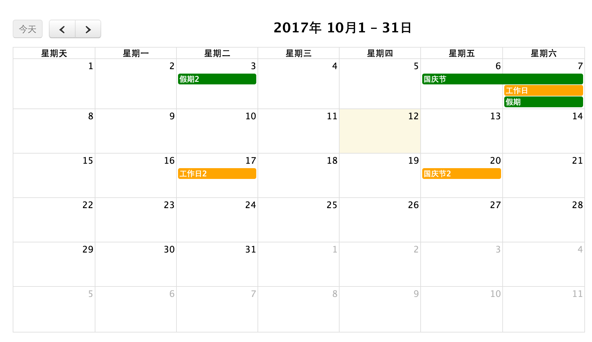

- fullCalender事件日历，显示全尺寸拖放事件日历。可定制和开源，但不能用于商业用途。
- fullCalender是基于jquery的插件，使用前需要引入jquery。
- 官方网址：[fullCalender](https://fullcalendar.io/)
- 兼容性：Chrome，Firefox，Safari，Opera，IE 9+
- 基于jQuery 2.0.0+

- 官网地址：https://fullcalendar.io/

  ​

## 参数说明

- selectable ，默认为false，是否允许用户通过单击并拖动进行选择。

- editable，默认为false，日历上的事件是否可以修改。

- aspectRatio，默认1.35，日历的宽高比.

- scrollTime，默认为6am。滚动条默认最下面的距离。设置为00：00.

## 效果

>  详见【[demo](/widget/jquery/holiday-calendar/index.html)】