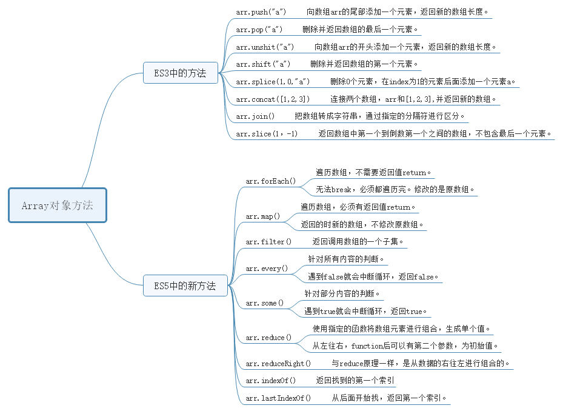
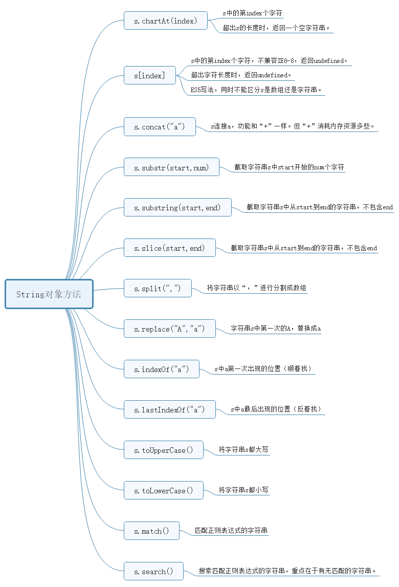

在js中经常会用到Array和String对象，其中有很多方法，现在通过思维导图总结一下：

## 1、Array对象方法思维导图

## 2、String对象方法思维导图

## 3、Array对象和String对象的关系

### （1）数组序列化以及反序列化

- `JSON.stringify([1,2,3])  `：
  - 输出：`'[1,2,3]'`
  - 将arr数组序列化输出，将Array对象转为String对象。
- `JSON.parse('[1,2,3]') `
  - 输出：`[1,2,3]`
  - 将str转成数组输出，将String对象转为Array对象。

### （2）Array和String的常用转换

- `[1,2,3].join('-') `
  -  输出：`'1-2-3'`，将数组元素以“-”顺序链接成一个字符串。
  - join()，默认为“,”逗号链接。
  - 如果不需要连接符可以写成`arr.join('')`。
- `'1-2-3'.split('-')`
  - 输出：`[ 'a', 'b', 'c' ]`，将字符串以“-”分隔符来进行分割成一个有序的数组。
  - split()，默认是直接转成一个数组`['1-2-3']`。
  - `'1-2-3'.split('-')`，转成每个字符串一个数组元素的格式，转成了`[ 'a', '-', 'b', '-', 'c' ]`。