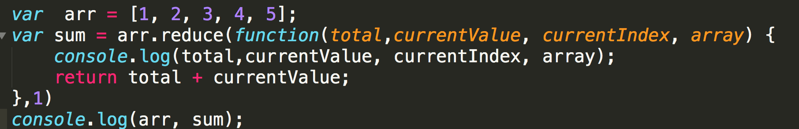
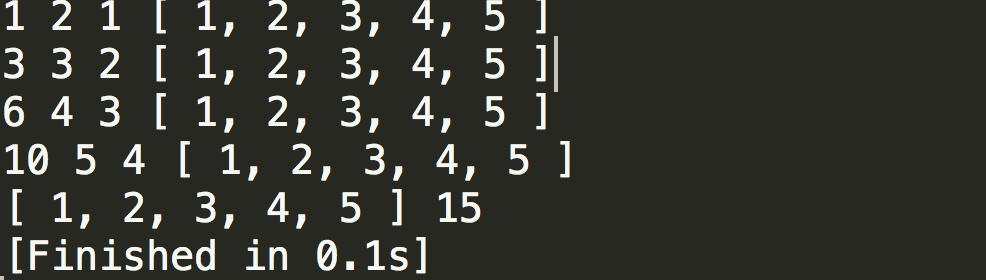

`reduce() `方法接收一个函数作为累加器（accumulator），数组中的每个值（从左到右）开始合并，最终为一个值。

## 1、基本用法

### 语法：

```js
array.reduce(function(total, currentValue, currentIndex, arr), initialValue)
```

### 参数：

- reduce，第一个参数为回调函数的参数：必需。用于执行每个数组元素的函数。这个回调函数中有4个参数，分别为：
  - total：必需。初始值或者计算结束后的返回值。
  - currentValue：必需。当前元素
  - currentIndex：可选。当前元素的索引
  - arr：可选。当前元素所属的数组对象。
- reduce，第二个参数：initialValue：可选。传递给函数的初始值


## 2、简单例子

- 数组求和

    

- 输出

    

## 3、实例例子

- 一个 Object对象，`obj={ a1:{ a2:{ a3:'value' } } }`，通过String类型的遍历器`"obj.a1.a2.a3"`直接取到value值，如何取。

 * Array的reduce方法来实现

   ```js
   var obj = {
       a1 :{
           a2:{
               a3:'value'
           }
       }
   };

   //console.log(obj.a1.a2.a3,obj['a1']['a2']['a3']);//value vlaue
   console.log(Fn(obj,'obj.a1.a2.a3')); //value

   function Fn (obj,selector){
       var str = selector.substr(selector.indexOf('.')+1,selector.length);
       var arr = str.split('.');
       var val = arr.reduce(function(total,currentValue,currentIndex){
           return total[currentValue];    
       },obj);
       return val;//实际转成了：obj['a1']['a2']['a3']，然后获取到“value”这个值。
   }
   ```

   ​