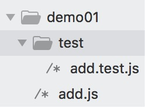
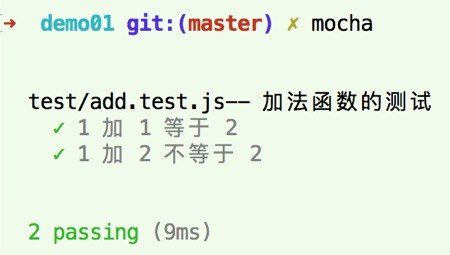
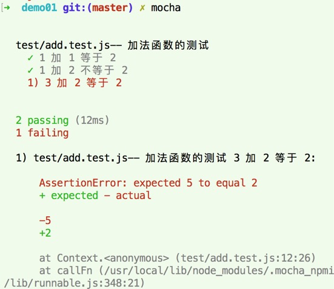

Mocha单元测试大致流程，主要讲解内容为：单元测试大致流程。Mocha的实现方式都是通过node的方式来实现的。

## 单元测试大致流程

- 全局安装：npm install --global mocha

- 创建项目：

  - 新建文件夹demo01，需要测试脚本 add.js

  - 新建文件夹test，放测试脚本，新建测试脚本add.test.js

    

- 项目依赖：

  - nam install --save-dev mocha  //测试框架
  - npm install --save-save chai       //断言库

- 终端运行，进入到demo01目录下，执行：mocha 

- 运行结果

  - 只有两种：测试通过或者测试不通过。

    - 通过

      

    - 不通过

      

  - 显示基本信息：测试条数、测试结果、测试时间、报错信息等。
  - 只有所有的测试用例通过了，该单元测试成功。
  - 只要有一条测试用例不通过，则该单元测试失败。

> 详见【[demo01](https://github.com/huanghui8030/Mocha/tree/master/demo01)】