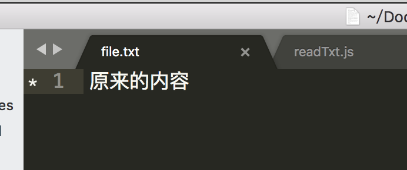
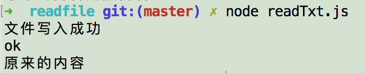
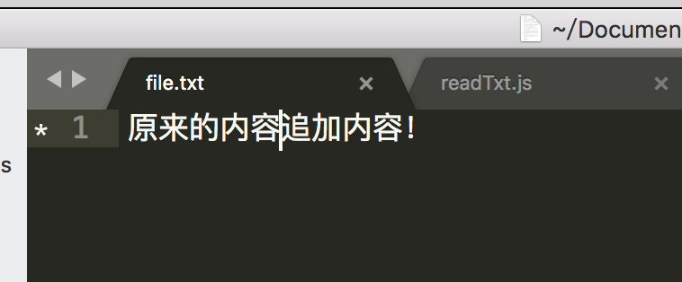

nodejs读取文件以及写入文件的方法

- 新建txt文件file/file.txt，写入任意内容，例如：

  


- 新建readText.js，写入以下内容：

```js
var fs= require("fs");
//读取文件
fs.readFile('file/file.txt',{flag:'r+',encoding:'utf-8'},function(err,data){
    if(err){
        console.log("bad")
    }else{
        console.log("ok");
        console.log(data.toString());
    }
})

//写入文件，a表示追加，w写入，r只读
var data = "追加内容！";
fs.writeFile('file/file.txt',data,{flag:'a',encoding:'utf-8',mode:'0666'},function(err){
     if(err){
         console.log("文件写入失败")
     }else{
        console.log("文件写入成功");
     }
}) 
```

- 终端执行：node readText.js

  

- 执行后文件中的内容：

  

  ​


> 详见 [demo](https://github.com/huanghui8030/node/tree/master/demo/readfile/)