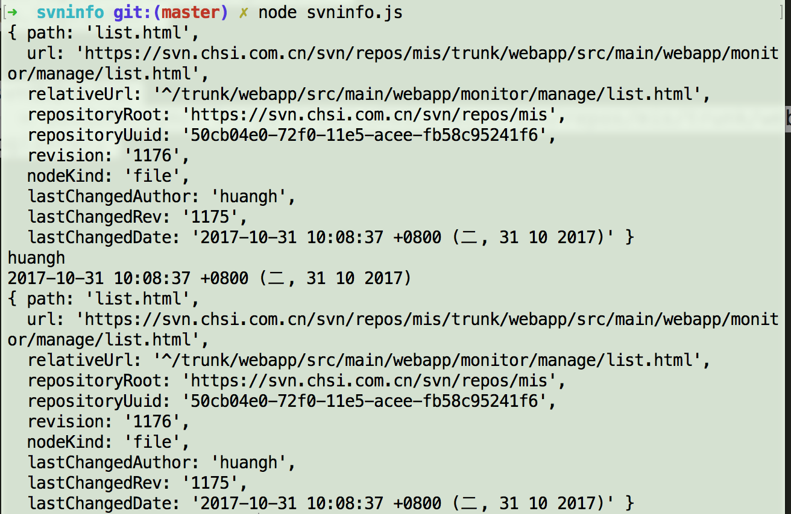

通过nodeJS获取svn记录信息，用到svn-info插件。获取到的内容比较有限，svn最后更新人和更新时间，但是针对更新提交的内容不能获取得到

### svn-info信息

- npm包d只：https://www.npmjs.com/package/svn-info


- gitHub地址：https://github.com/jtrussell/node-svn-info

### svn-info用法

- 新建svn-info.js，写入代码（异步获取和同步获取两种）：

```js
var svnInfo = require('svn-info');
var svnUrl = 'https://svn.chsi.com.cn/svn/test.html';
//异步获取svn信息的方法
svnInfo(svnUrl, 'HEAD', function(err, info) {
    if(err) {
    throw err;
    }
    console.log(info.lastChangedAuthor);
    console.log(info.lastChangedDate)
    console.log(info);
});

//同步获取svn信息的方法
var  info  = svnInfo.sync(svnUrl, 'HEAD') ;  
console.log(info);
```

- 终端执行：node svninfo.js

- 结果显示：

  

  ​


> 详见[demo](https://github.com/huanghui8030/node/tree/master/demo/svninfo/)

