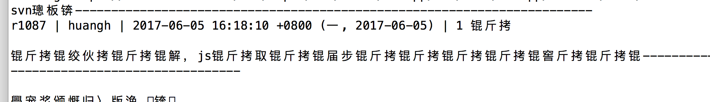
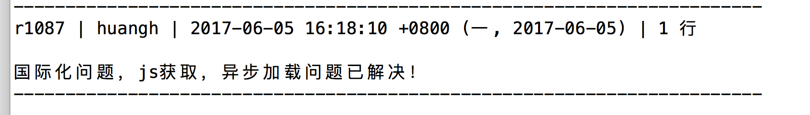

通过nodeJs中的exec或者是execSync方法，获取svn信息时，如果服务器端不是utf-8的编码的话，获取的内容会出现乱码。




通过`iconv-lite`的npm依赖包，方法如下：

- 执行项目依赖：`npm install iconv-lite --save-dev`

  ```js
  var child_process=require('child_process');
  var iconv=require('iconv-lite');

  //获取svn 信息，其中svnUrl为svn实际地址
  var svnLog = 'svn log '+svnUrl+'  -l 1';
  //根据实际情况选择符合服务器端的编码即可
  var encoding = 'GBK';
  //异步方法
  child_process.exec(svnLog,function(error,stdout,stderr){
    	var newData = iconv.decode(new Buffer(stdout), encoding);//编码转换
  	console.log(newData);
  });
  //execSync同步方法

  var logStr = child_process.execSync(svnLog,encoding);
  var data = iconv.decode(new Buffer(logStr), encoding);//解决字符编码问题
  console.log(data);                     
  ```

- 效果图：

  


