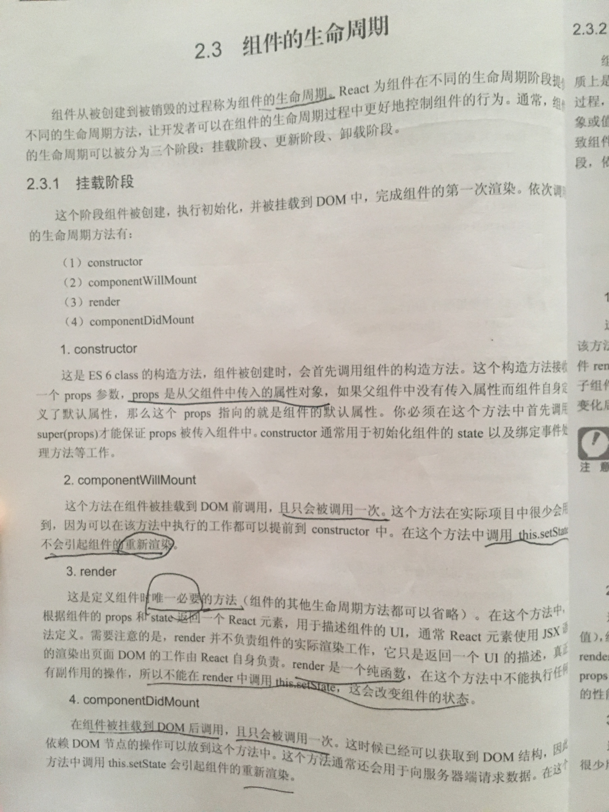
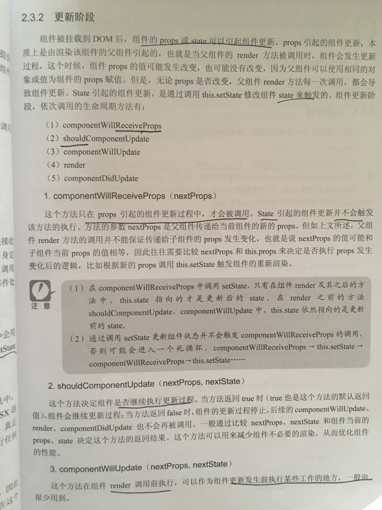
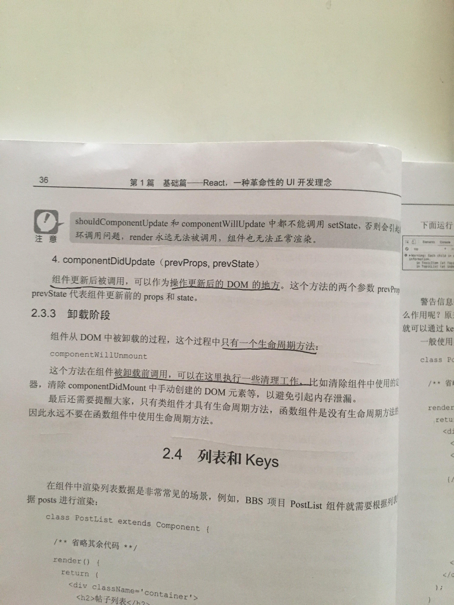

## React的生命周期

分成三个状态：Mounting、Updating、Unmouting。

### 1、Mounting：已插入真实 DOM

- constructor()：继承构造函数
- componentWillMount()：在渲染前调用,在客户端也在服务端。可以使用this.setState()，但是不变化。（新版react该方法已废弃）
- render()：渲染真实的DOM
- componentDidMount()：在第一次渲染后调用，只在客户端。之后组件已经生成了对应的DOM结构，可以通过this.getDOMNode()来进行访问。 如果你想和其他JavaScript框架一起使用，可以在这个方法中调用setTimeout, setInterval或者发送AJAX请求等操作(防止异部操作阻塞UI)。可以使用this.setState()

### 2、Updating：正在被重新渲染，初始化时均不调用

- componentWillReceiveProps(nextProps)：在组件接收到一个新的 prop (更新后)时被调用。可以使用this.setState()。
- shouldComponentUpdate(nextProps,nextState)：返回一个布尔值。在组件接收到新的props或者state时被调用。在使用forceUpdate时不被调用。 可以在你确认不需要更新组件时使用。true下一步，false返回不更新。setState()。不能使用this.setState()，会造成死循环。
- componentWillUpdate(nextProps,nextState)：在组件接收到新的props或者state但还没有render时被调用。在使用forceUpdate的时候可以调用。不能使用this.setState()，会造成死循环。（新版react该方法已废弃）
- render()：重新渲染真是的DOM
- componentDidUpdate：在组件完成更新后立即调用。可以使用this.setState()

### 3、Unmouting：已移出真实 DOM

- componentWillUnmount：在组件从 DOM 中移除的时候立刻被调用。

## 《React进阶之路》

（出版时间：2018-03-01）中的介绍如下：

> 整理时间：2018-06-14