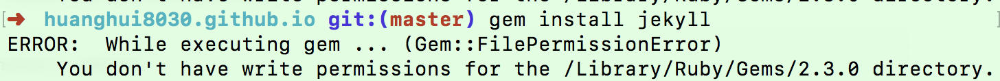
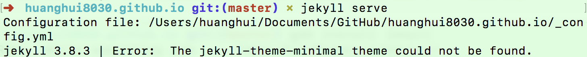

​Jekyll 是一个简单的博客形态的静态站点生产机器。它有一个模版目录，其中包含原始文本格式的文档，通过 Markdown （或者 Textile） 以及 Liquid 转化成一个完整的可发布的静态网站，你可以发布在任何你喜爱的服务器上。Jekyll 也可以运行在 GitHub Page 上，也就是说，你可以使用 GitHub 的服务来搭建你的项目页面、博客或者网站，而且是完全免费的。

## 开始

以下是最简单的Jekyll模板并生成静态页面的方法

```js
~ $ gem install jekyll
~ $ jekyll new myblog
~ $ cd myblog
~/myblog $ jekyll serve
# => Now browse to http://localhost:4000
```

#### 【安装jekyll时报错】

安装的时候：`gem install jekyll`，如果以下报错的话，说明是权限的问题。

```js
ERROR:  While executing gem ... (Gem::FilePermissionError)
    You don't have write permissions for the /Library/Ruby/Gems/2.3.0 directory.
```



##### 【解决方法】

控制台执行：`sudo gem install jekyll`，记住和`npm`不一样，不需要加`-g`。


#### 【启动时报错】

启动：`jekyll serve` 时，报错如下，说明是样式模板没有安装。

```js
Configuration file: /Users/huanghui/Documents/GitHub/huanghui8030.github.io/_config.yml
jekyll 3.8.3 | Error:  The jekyll-theme-minimal theme could not be found.
```



##### 【解决方法】

控制台执行：`sudo gem i jekyll-theme-minimal `，安装一下相应的模板。


## 基本用法

安装了 Jekyll 的 Gem 包之后，就可以在命令行中使用 Jekyll 命令了。有以下这些用法：

```
$ jekyll build
# => 当前文件夹中的内容将会生成到 ./site 文件夹中。

$ jekyll build --destination <destination>
# => 当前文件夹中的内容将会生成到目标文件夹<destination>中。

$ jekyll build --source <source> --destination <destination>
# => 指定源文件夹<source>中的内容将会生成到目标文件夹<destination>中。

$ jekyll build --watch
# => 当前文件夹中的内容将会生成到 ./site 文件夹中，
#    查看改变，并且自动再生成。
```

Jekyll 同时也集成了一个开发用的服务器，可以让你使用浏览器在本地进行预览。

```
jekyll serve
# => 一个开发服务器将会运行在 http://localhost:4000/

jekyll serve --detach
# => 功能和`jekyll serve`命令相同，但是会脱离终端在后台运行。
#    如果你想关闭服务器，可以使用`kill -9 1234`命令，"1234" 是进程号（PID）。
#    如果你找不到进程号，那么就用`ps aux | grep jekyll`命令来查看，然后关闭服务器。[更多](http://unixhelp.ed.ac.uk/shell/jobz5.html).

jekyll serve --watch
# => 和`jekyll serve`相同，但是会查看变更并且自动再生成。
```

## 参考文档

- [jekyll-docs](http://jekyllrb.com/docs/home)
- [jekyll-gh](https://github.com/jekyll/jekyll)
- [jekyll-talk](https://talk.jekyllrb.com/)

>  huanghui8030@qq.com 于 2016.07.26 整理，如有误请指正。2018.06.19更新。