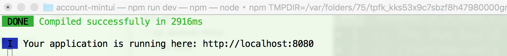
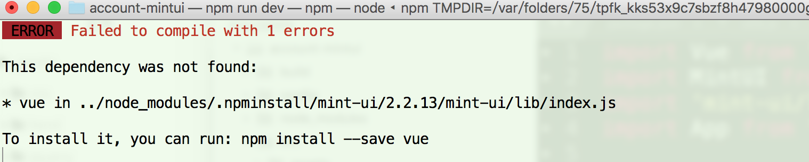
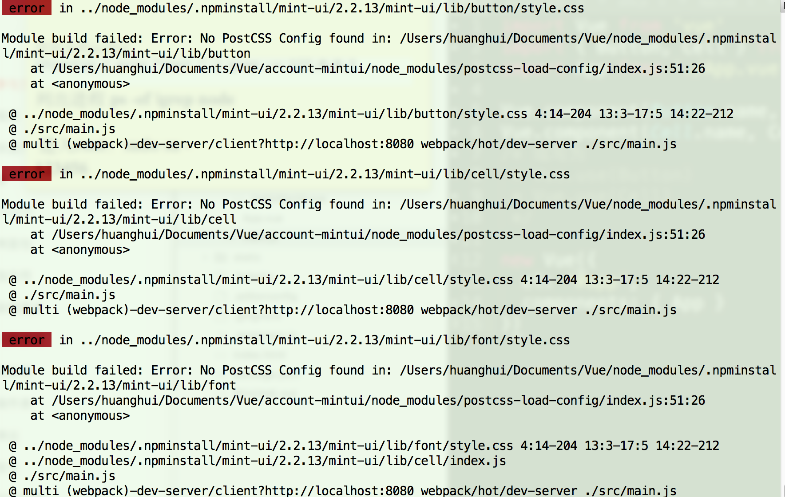
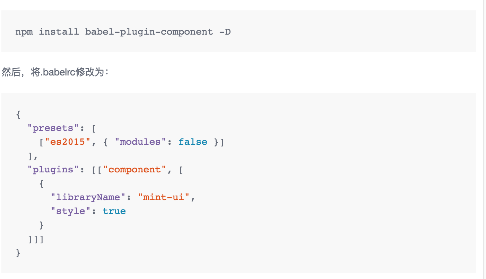
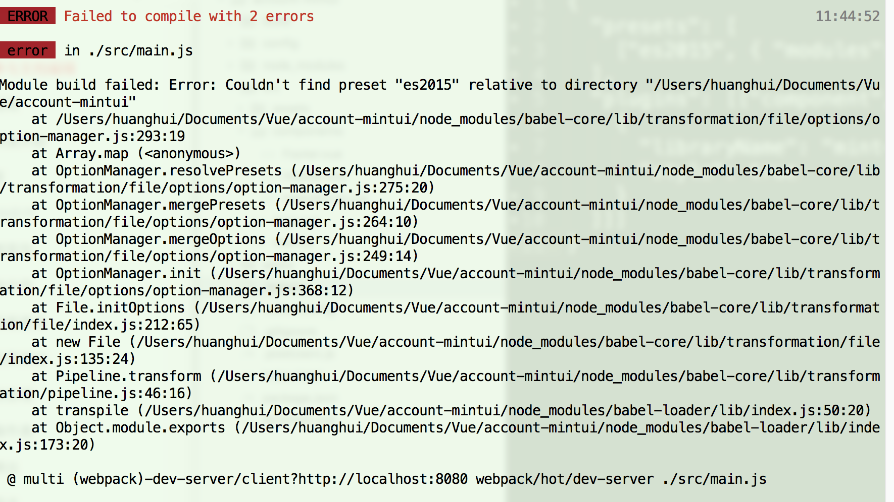
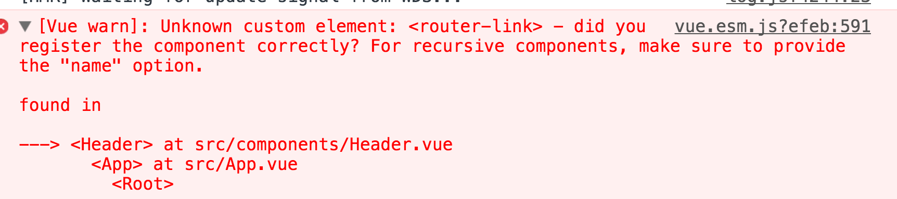
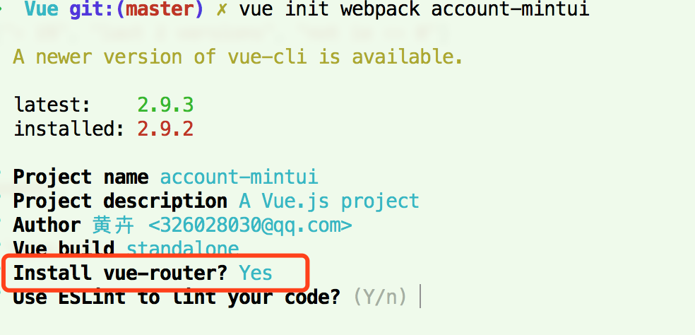

vue-cli配置mint-ui时报错- Module build failed: Error: No PostCSS。最近想到用[Mint UI](http://mint-ui.github.io/docs/#/zh-cn2/quickstart) 饿了么的移动端ui框架，但是在使用vue-cli脚手架时，发现有报错信息。而且是根据官方文档的步骤进行的，其中也有错误的步骤。

官方地址步骤：http://mint-ui.github.io/docs/#/zh-cn2/quickstart

## 具体步骤

### 1、安装脚手架，启动服务

- 使用vue-cli以及mint-ui：

  ```js
  cnpm install -g vue-cli       //全局安装vue-cli
  vue init webpack account-mintui  //新建项目account-mintui
  cnpm i mint-ui -S              //安装mintui
  ```

- 项目启动：cnpm run dev

- 启动成功：

  


### 2、修改main.js时项目启动报错信息

#### （1）完整引入mint-ui

- main.js修改

    ```js
    import Vue from 'vue'
    import MintUI from 'mint-ui'
    import 'mint-ui/lib/style.css'
    import App from './App.vue'

    Vue.config.productionTip = false

    Vue.use(MintUI)

    new Vue({
      el: '#app',
      components: { App }
    })
    ```

- 如果出现如下报错信息，则是由于没有安装mint-ui，需要执行：`cnpm i mint-ui -S  `

    

#### （2）按需引入mint-ui

- main.js修改

    ```js
    import Vue from 'vue'
    import { Button, Cell } from 'mint-ui'
    import App from './App.vue'

    Vue.config.productionTip = false

    Vue.component(Button.name, Button)
    Vue.component(Cell.name, Cell)

    new Vue({
      el: '#app',
      components: { App }
    })
    ```

- 报错信息：Module build failed: Error: No PostCSS Config found in: /Users/huanghui/Documents/Vue/node_modules/.npminstall/mint-ui/2.2.13/mint-ui/lib/cell

    


- 如果出现上图所示的报错信息，需要修改配置文件/build/util.js，修改postcssLoader里面的options配置。

  ```js
  const postcssLoader = {
      loader: 'postcss-loader',
      options: {
        sourceMap: options.sourceMap
      }
    }
  ```

  修改为：

  ```js
  const postcssLoader = {
      loader: 'postcss-loader',
      options: {
        sourceMap: options.sourceMap,
        modules:true  //添加
      }
    }
  ```

  这样修改后，项目就可以正常启动了。引入样式也没有问题了。

### 3、修改.babelrc时错误的步骤。

- 官方修改步骤：

  

- 但是修改后会发现，报错：Module build failed: Error: Couldn't find preset "es2015" relative to directory "/Users/huanghui/Documents/Vue/account-mintui"

  

- 实际修改，只用修改plugins参数即可，ES015已经不再使用了，用env代替了。其他也就是通过vue-cli生成时候的参数。具体如下：

  ```json
  {
    "presets": [
      ["env", {
        "modules": false,
        "targets": {
          "browsers": ["> 1%", "last 2 versions", "not ie <= 8"]
        }
      }],
      "stage-2"
    ],
    "plugins": [["component", [
      {
        "libraryName": "mint-ui",
        "style": true
      }
    ]]]
  }
  ```

### 4、如果控制台出现

- 控制台报错信息：

  ```js
  [Vue warn]: Unknown custom element: <router-link> - did you register the component correctly? For recursive components, make sure to provide the "name" option.
  ```

  

- 该问题是由于**没有引入router**，在初始化的时候请选择`y`：

  

