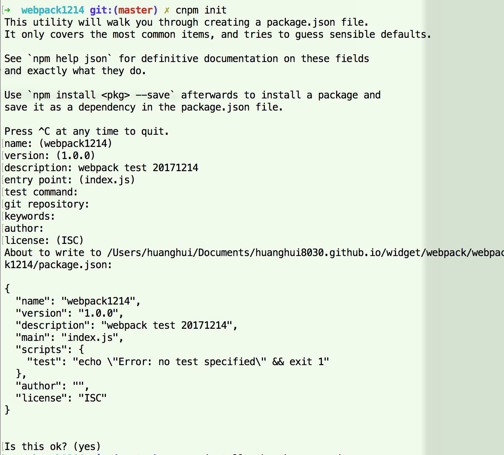
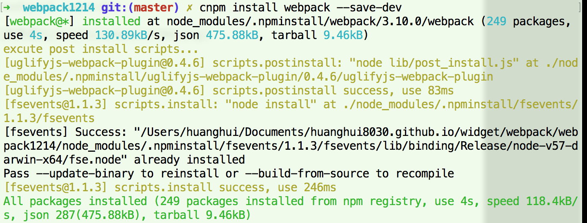
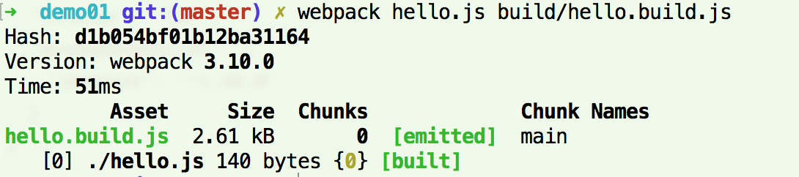
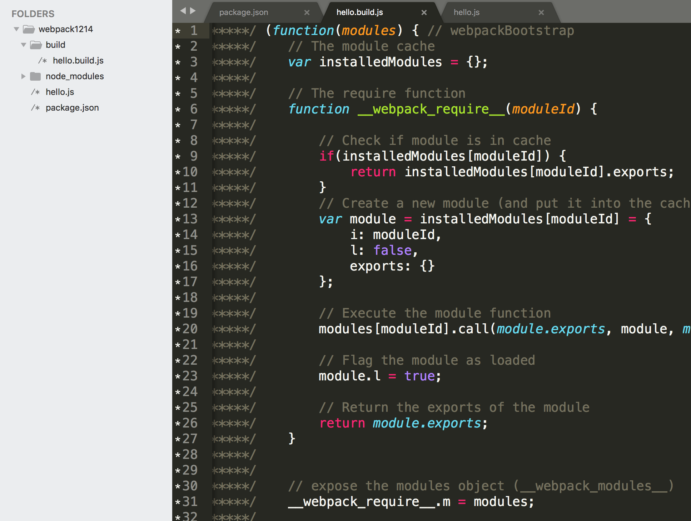
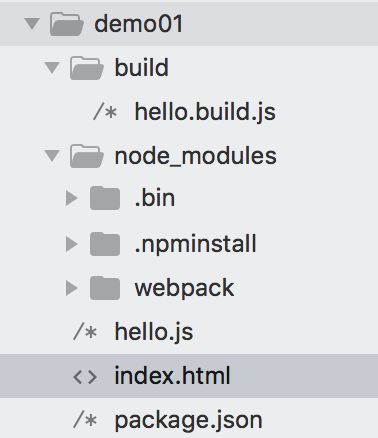

webpack简单打包，不写任何配置时的打包方法，如下：

## 安装

- 全局安装：` cnpm install webpack -g`
- 项目依赖：`npm install webpack --save-dev`
- 项目初始化：`cnpm init`

## 简单demo

- 新建一个包“webpack1214/demo01”，执行：cnpm init：

  

- package.json，如下：

  ```json
  {
    "name": "webpack1214",
    "version": "1.0.0",
    "description": "webpack test 20171214",
    "main": "index.js",
    "scripts": {
      "test": "echo \"Error: no test specified\" && exit 1"
    },
    "author": "huanghui",
    "license": "ISC",
    "devDependencies": {
      "webpack": "^3.10.0"
    }
  }
  ```

- 初始化webpack，执行：cnpm install webpack --save-dev

  


- 新建一个hello.js，代码如下：

  ```js
  function a(){
      alert('hello.js');
  }
  ```

- 执行：webpack hello.js build/hello.build.js

  

- 生成的效果如下：

  

- 新建一个index.html，将生成的build/hello.build.js文件引入即可。


  

- 最后形成的文件路径如下：

  


另：以上图片不是最新，更换了目录，放到demo01里面去了。

## 说明

- 直接在页面引入打包后的js即可。连样式都不用引入，脚本执行时会动态生成<style>并标签打到head里。
- 根据需要也可以将css单独放到一个css文件中。

  ​

> 详见【[demo01](https://github.com/huanghui8030/webpack/tree/master/demo01)】

